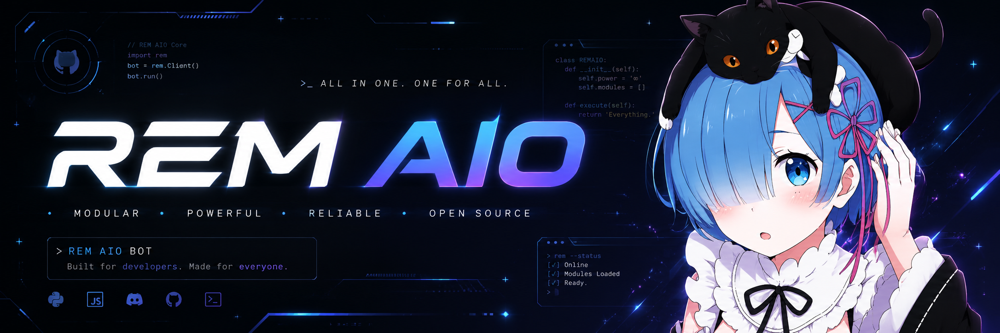

<p align="center">
  
</p>

<h1 align="center">♡ REM ALL IN ONE BOT ♡</h1>

<p align="center">
  <b>✧ your cute all-in-one Discord companion ✧</b><br>
  moderation · security · music · tickets · games · welcome · logging & more~
</p>

<p align="center">
  <i>(ﾉ◕ヮ◕)ﾉ*:･ﾟ✧ pastel panels · 119 cogs · 400+ commands · built with love by devrock</i>
</p>

<br>

<p align="center">

  <!-- primary action buttons -->
  <a href="https://discord.com/oauth2/authorize?client_id=1144179659735572640&permissions=8&scope=bot%20applications.commands">
    
  </a>
  <a href="https://discord.gg/codexdev">
    
  </a>
  <a href="https://top.gg/bot/1144179659735572640/vote">
    
  </a>
  <a href="https://github.com/devrock07/REM-AIO">
    
  </a>

</p>

<p align="center">

  <!-- status badges -->
  
  
  
  
  

</p>

<br>

<p align="center">
  ♡ ╭──────────────────────────────────────────────────────────╮ ♡<br>
  ♡ │&nbsp;&nbsp; <a href="#-quick-start">Quick Start</a> · <a href="#-features">Features</a> · <a href="#-music-player">Music</a> · <a href="#-setup-guide">Setup</a> · <a href="#-environment">Env</a> · <a href="#-project-map">Project</a> &nbsp;&nbsp;│ ♡<br>
  ♡ ╰──────────────────────────────────────────────────────────╯ ♡
</p>

<br>

## ♡ Quick Start

```bash
pip install -r requirements.txt
copy .env.example .env    # Windows
# cp .env.example .env    # macOS / Linux
python rem.py
```

> ✿ Set `TOKEN` and `OWNER_IDS` in `.env` before starting — that's the minimum~

<br>

## ✧ Features

<table>
<tr>
<td width="50%" valign="top">

### ♡ Panels & UI
- Components V2 help, utility & music cards
- Kawaii pastel music player, search & queue
- Auto-expiring help panels
- Paginated CV2 lists

### ♡ Music
- Lavalink / Wavelink playback
- Interactive player controls
- Multi-platform search (YouTube, JioSaavn, SoundCloud)
- Queue, loop, shuffle, autoplay, volume

### ♡ Moderation
- Ban · kick · timeout · warn
- Lock · hide · role · purge · snipe
- Jail & nightmode tools

### ♡ Security
- Antinuke event listeners
- Automod: spam, caps, links, invites
- Blacklist, block & whitelist systems

</td>
<td width="50%" valign="top">

### ♡ Server Tools
- Tickets · giveaways · logging
- Welcome · autorole · custom roles
- Vanity roles · invite tracker

### ♡ Utility
- Stats · botinfo · AFK · translate
- QR codes · emoji sync · maps
- AI chat (optional OpenAI key)

### ♡ Games
- Chess · RPS · Wordle · 2048
- Blackjack · slots & more

### ♡ Admin
- No-prefix · global actions
- Owner tools · emergency controls

</td>
</tr>
</table>

<br>

## ♡ Music Player

<p align="center">
  
  
  
</p>

Cute CV2 cards for the whole music flow — player, search results, queue pages, and action toasts all match~

| Command | What it does |
| --- | --- |
| `>play <query>` | Play a song or playlist |
| `>search <query>` | Pick a platform & search |
| `>nowplaying` | Live progress & track info |
| `>queue` | Paginated upcoming tracks |
| `>pause` / `>resume` / `>skip` | Playback controls |
| `>volume <1-150>` | Set player volume |
| `>loop` / `>shuffle` / `>autoplay` | Queue modes |

Configure Lavalink in `.env`:

```env
LAVALINK_ENABLED=true
LAVALINK_IDENTIFIER=main
LAVALINK_URI=http://127.0.0.1:2333
LAVALINK_PASSWORD=youshallnotpass
LAVALINK_PRECHECK=true
```

> ✿ Restart `python rem.py` fully after music or code changes — hot reload won't update a running process~

<br>

## ♡ Setup Guide

### Requirements

| Need | Why |
| --- | --- |
| Python **3.11+** | Runtime |
| `TOKEN` | Discord bot token |
| **Message Content** intent | Prefix commands |
| **Server Members** intent | Mod, welcome, antinuke |
| Lavalink node *(optional)* | Music playback |

### Installation

**1.** Install dependencies

```bash
pip install -r requirements.txt
```

**2.** Create your env file

```bash
copy .env.example .env    # Windows
```

**3.** Fill in `.env` *(never commit this file!)*

```env
TOKEN=your_discord_bot_token
BOT_NAME=REM ALL IN ONE BOT
OWNER_IDS=123456789012345678
LAVALINK_ENABLED=true
LAVALINK_URI=http://127.0.0.1:2333
LAVALINK_PASSWORD=youshallnotpass
```

**4.** Run the bot

```bash
python rem.py
```

On startup you'll see the REM console banner, cog load progress, shard connections, and a ready summary ✧

<br>

## ♡ Environment

| Key | Required | Purpose |
| --- | :---: | --- |
| `TOKEN` | ✅ | Discord bot token |
| `OWNER_IDS` | ✅ | Comma-separated owner user IDs |
| `BOT_NAME` | — | Display name in panels |
| `BYPASS_IDS` | — | Users that bypass security checks |
| `COMMAND_LOG_WEBHOOK_URL` | — | Command usage log webhook |
| `LAVALINK_URI` / `LAVALINK_PASSWORD` | 🎵 | Lavalink music node |
| `OPENAI_API_KEY` | — | Optional AI/chat features |
| `SPOTIFY_CLIENT_ID` / `SECRET` | — | Optional Spotify resolution |
| `GIPHY_TOKEN`, `PEXELS_API_KEY`, etc. | — | Optional fun/utility APIs |

See [`.env.example`](.env.example) for the full list~

<br>

## ♡ Permissions

<p align="center">
  
</p>

Or grant these manually:

- Manage Server, Roles, Channels, Messages
- Ban / Kick / Moderate Members, View Audit Log
- Send Messages, Embed Links, Attach Files, Use External Emojis
- Connect, Speak *(for music)*

Setup commands (antinuke, automod, tickets, emergency, etc.) are restricted to owners, bypass users, server owners, or administrators.

<br>

## ♡ Project Map

```text
rem.py              ♡ entry point
core/rem.py         ♡ Rem bot class (AutoShardedBot)
core/Context.py     ♡ custom command context
cogs/commands/      ♡ user-facing commands
cogs/rem/           ♡ help category panels
cogs/moderation/    ♡ moderation actions
cogs/antinuke/      ♡ antinuke listeners
cogs/automod/       ♡ automod listeners
cogs/events/        ♡ guild & error events
utils/              ♡ config, database, console, CV2 UI
utils/music_panel.py♡ kawaii music card builders
db/                 ♡ per-feature SQLite databases
data/               ♡ runtime assets
games/              ♡ standalone game engines
```

<br>

## ♡ Development

**Syntax check**

```bash
python -m compileall rem.py cogs utils core
```

**Health endpoint** *(when keep-alive is enabled)*

```text
GET http://127.0.0.1:8080/health
```

<br>

## ♡ Security

- Regenerate your bot token if it's ever exposed
- Keep `.env`, databases, and logs out of git
- Limit `OWNER_IDS` and `BYPASS_IDS` to trusted users
- Restart after permission, security, or environment changes

<br>

## ♡ Logs

Console output uses the REM anime-style logger ✧

Full debug logs are written to:

```text
logs/rem.log
```

<br>

## ♡ License & Credits

<p align="center">
  <a href="LICENSE">
    
  </a>
</p>

**MIT License** — Copyright (c) 2026 **devrock**

See [LICENSE](LICENSE) for full terms.

<br>

<p align="center">
  <b>♡ REM ALL IN ONE BOT ♡</b><br>
  made with love by <b>devrock</b><br><br>
  <a href="https://discord.com/oauth2/authorize?client_id=1144179659735572640&permissions=8&scope=bot%20applications.commands">
    
  </a>
  <a href="https://discord.gg/codexdev">
    
  </a>
  <a href="https://top.gg/bot/1144179659735572640/vote">
    
  </a>
  <a href="https://github.com/devrock07/REM-AIO">
    
  </a>
  <br><br>
  <i>♡(˶ᵔ ᵕ ᵔ˶)♡ thanks for choosing REM~</i>
</p>